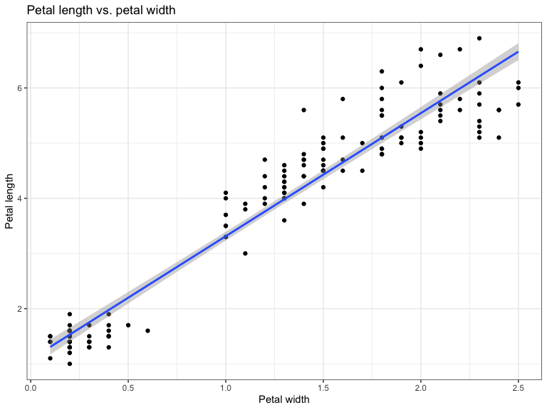

# Play with Quarto v. 1.4
Charalampos A. Lazaris
2024-02-18

- [Introduction](#introduction)
- [Code](#code)
  - [`Markdown` formatting:](#markdown-formatting)

# Introduction

This is a Quarto tutorial based on the official Posit cheatsheet. It
features some of the new features in Quarto v. 1.4.

# Code

Let’s insert some inline code in R: 2 gives 2

Here is some `R` code:

<details open class="code-fold">
<summary>Code</summary>

``` r
p <- 1 + 1
print(p)
```

</details>

    [1] 2

Now, let’s import some data and create a graph, after loading the
required libraries:

<details open class="code-fold">
<summary>Code</summary>

``` r
library(tidyverse)
```

</details>
<details open class="code-fold">
<summary>Code</summary>

``` r
data(iris)
glimpse(iris)
```

</details>

    Rows: 150
    Columns: 5
    $ Sepal.Length <dbl> 5.1, 4.9, 4.7, 4.6, 5.0, 5.4, 4.6, 5.0, 4.4, 4.9, 5.4, 4.…
    $ Sepal.Width  <dbl> 3.5, 3.0, 3.2, 3.1, 3.6, 3.9, 3.4, 3.4, 2.9, 3.1, 3.7, 3.…
    $ Petal.Length <dbl> 1.4, 1.4, 1.3, 1.5, 1.4, 1.7, 1.4, 1.5, 1.4, 1.5, 1.5, 1.…
    $ Petal.Width  <dbl> 0.2, 0.2, 0.2, 0.2, 0.2, 0.4, 0.3, 0.2, 0.2, 0.1, 0.2, 0.…
    $ Species      <fct> setosa, setosa, setosa, setosa, setosa, setosa, setosa, s…

We now plot `Petal.Length` vs. `Petal.Width`:

<details open class="code-fold">
<summary>Code</summary>

``` r
#| fig-cap: "Petal length vs. petal width in iris species"
ggplot(data = iris, aes(x = Petal.Width, y = Petal.Length)) +
    geom_point() +
    geom_smooth(method = "lm", se = TRUE) +
    ggtitle("Petal length vs. petal width") +
    xlab("Petal width") + ylab("Petal length") +
    theme_bw()
```

</details>

    `geom_smooth()` using formula = 'y ~ x'



> [!TIP]
>
> ### Consistency
>
> Use `dplyr` for data wrangling and `ggplot2` for plotting - keep it
> consistent

## `Markdown` formatting:

Here is some **bold** text and here is some text in *italics*. We can
also <u>text</u> or strikethrough text: ~~hello~~. We can also create
some lists. Let’s start with a numbered list:

1.  First
2.  Second
3.  Third

Now, let’s make the same list, nested:

1.  First
    1.  Hello
    2.  Hi
    3.  Ciao
2.  Second
3.  Third

We can also have unordered lists:

- First
  - Hello
  - Hi
  - Ciao
    - 1
- Second
- Third

We can also insert links to URLs: [my
website](https://chlazaris.netlify.app) or links to pictures. Here is a
photo of my favorite writer:


We can also insert tables:

| ID  | Name       | Surname |
|-----|------------|---------|
| 1   | James      | Dean    |
| 2   | Marlon     | Brando  |
| 3   | Montgomery | Cliff   |
